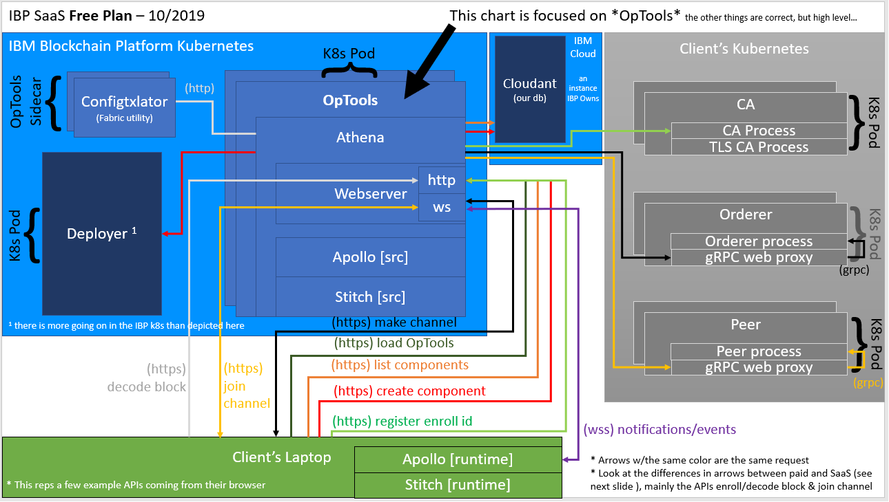

# Proxy Routes

OpTools sometimes needs to proxy requests for the UI (browser).
This is often done to get around untrusted self-signed certificates and sometimes CORS restrictions.
What controls this behavior is if the IBM Cloud K8s plan is free or paid.
With free a plan the user does not get DNS accessible hostnames or proper tls certs.
They will have components addressable by IP, and self-signed certs.

Also historically the CA did not support CORS. But that is a legacy issue.

Without these routes the user would be forced to manually browse to their component's http server and accept it's TLS cert.
Repeat for each component, and repeat per browser.
That would suck, so we use these routes to make OpTools proxy the call for the browser.
The node.js runtime is told to not care about the self-signed certs and CORS is not applicable.

**Skip to the bottom to see diagrams on what I mean.**

## 1. Generic Proxy API
Allows Apollo to call things he may not be able to from the browser.

dsh - this api is kind of terrible, use the other proxy routes if possible.
Very rigid format.

- **Method**: POST
- **Route**: `/api/v1/proxy`
- **Auth**: Must have action `blockchain.optools.view` in session
- **Body**:
```js
// this body contains the request and an embedded **body**, when necessary
{
  "url": "<some url>", // url to hit including port and path
  "method": "POST" || "GET" || "PUT" || "DELETE",
  "body": {},  // [optional] body to send
  "query": "test=yes&testing=no",  // (optional) string already formatted
  "skip_cache": false,    // [optional] - defaults false
  "cert": "<base 64 encoded *client* cert PEM for mutual TLS>",  // [optional]
  "key": "<base 64 encoded *client* key PEM for mutual TLS>"  // [optional]
  "ca": "<base 64 encoded TLS PEM to verify connection>"  // [optional]
}
```
- **Response**:
```js
// whatever is returned from the request - will vary since this is generic
{}
```

## 2. Proxy to a Deployer API
This api exists to hide the athena-to-deployer basic auth from clients.
See [deployer readme #1a.](./deployer_apis.md#dep_proxy).

## 3. Proxy to a Peer's GRPC Web Proxy API
This is a TLS workaround for **peers** w/untrusted TLS certificates.
The browser can send a proxy http request to the server who will forward the call on to the grpc-web proxy.
The server will accept self-signed certs.

Note that the timeout for athena to **respond** to this request is not the server default of `http_timeout`.
Instead it is with `grpcwpp_timeout` which is typically 5 minutes.

The timeout for the athena to **get** a response from the grpc web proxy is also set by `grpcwpp_timeout`.

- **Method**: Any (GET/POST/HEAD/DELETE/PUT/PATCH/OPTIONS)
- **Route**: `/grpcwp/*`
- **Auth**: Must have action `blockchain.optools.view` in session
- **Body**: Plain text
- **Response**: route dependent
- **Example**: a `POST` request to `http://<athenas_url>/grpcwp/https://169.46.208.195:317266/peer.Endorser/ProcessProposal` will send a `POST` to `https://169.46.208.195:317266/peer.Endorser/ProcessProposal`. Body and headers are copied.

## 4. Proxy to a Configtxlator API
This is a workaround for an https OpTools server using an http **configtxlator**.
Because the browsers won't allow mix-content aka http client reqs on a https domain.
Thus the browser can send its configtxlator request to this proxy route and the server will call the http configtxlator.

The target url (the one for configtxlator) is not sent in this API.
Rather, the server gets the url from the setting `CONFIGTXLATOR_URL_ORIGINAL`.

The body and headers in the initiating request are forwarded on to configtxlator.

- **Method**: Any (GET/POST/HEAD/DELETE/PUT/PATCH/OPTIONS)
- **Route**: `/configtxlator/?*`
- **Auth**: Must have action `blockchain.optools.view` in session
- **Body**: Plain text only
- **Response**: route dependent
- **Example**: a `POST` request to `http://<athenas_url>/configtxlator/protolator/decode/common.ConfigUpdate` will send a `POST` to `https://<configtxlator_url>/protolator/decode/common.ConfigUpdate`.

## 5. Proxy to a CA API
This is a CORS + self-signed cert workaround for **CAs** (1.4.1 and lower CA's do not support CORS).
The browser can send a proxy request to OpTools who will call the CA.
This bypasses CORS and the server will accept the self-signed cert if applicable.

Possible proxy destinations urls are white list protected.
White list is built from onboarded components.

- **Method**: Any (GET/POST/HEAD/DELETE/PUT/PATCH/OPTIONS)
- **Route**: `/caproxy/*`
- **Auth**: Must have action `blockchain.optools.view` in session
- **Body**: JSON
- **Response**: route dependent
- **Example**: a `POST` request to `http://<athenas_url>/caproxy/https://169.46.208.195:317266/api/v1/identities` will send a `POST` to `https://169.46.208.195:317266/api/v1/identities`. Body and headers are copied.

## 6. Proxy to an Orderer's GRPC Web Proxy API
This is a TLS workaround for **orderers** w/untrusted TLS certificates.
The browser can send a proxy `ws` or `wss` request to the server who will forward the call on to the grpc-web proxy.
The server will accept self-signed certs.

- **Protocol**: `websocket` & `http` supported
- **Method**: ?
- **Route**: `/grpcwp/*`
- **Auth**: n/a
- **Body**: any
- **Response**: route dependent

# Free vs Paid Diagrams
These diagrams are showing how some routes use the proxy routes documented on this page.

Below is an architecture diagram. It shows a few routes for a **paid** plan.
Notice how fabric arrows go direct to the components, no proxying.


Below is an architecture diagram. It shows a few routes for a **free** plan.
Notice how fabric arrows go to Athena and get proxied to the component.

> Optools for **Software** is *similar* to the picture below.
The routes coming out of the laptop box are accurate, but all other boxes are wrong. There is no cloudant, or IBM Cloud components in Software. Meaning its the same routes that get proxied in "SaaS free" and in software.


